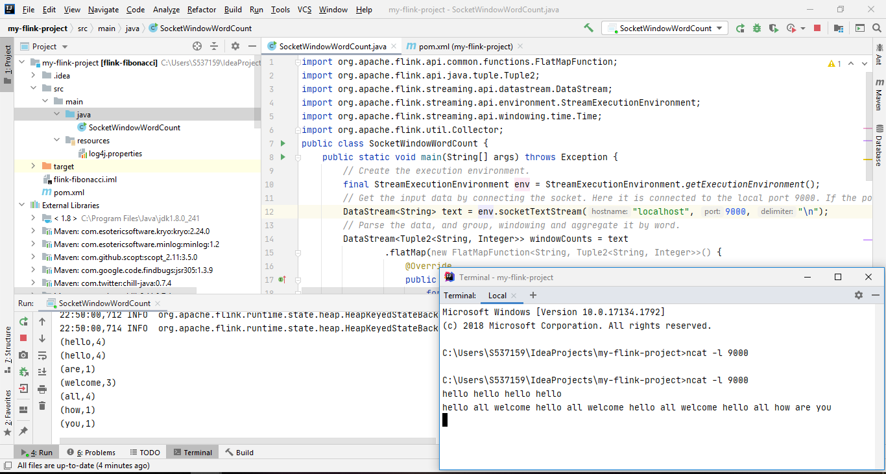

# bigdata-flink-project

## Team members names
- Prasanna Kumar
- Yugandhar
- Gangadhar
- Abhiteja
- Jack Beaver

<br>

## Gangadhar
### Demonstartion Skill:
* I would like to demonstrate on Introduction to Flink, downloading, configuring and verifying the installation on windows  <br>

### Prerequisites:
* Apache Flink Installed (2.12 or 2.11)
* Java Installed (Java8 or Java11)
* IntelliJ IDE installed
* NetCat Installated: [https://nmap.org/download.html](https://nmap.org/download.html)

### Introduction to Flink

- Apache Flink is an Open source stream processing framework for distributed, high performance data streaming application.
- Flink also provides batch processing, graph processing, Itearative proccessing for Machine learning applications. 
- Flink is considered as the next-gen stream processing system. 
- Flink offers substantially higher processing speeds to spark and hadoop.
- Flink provides low latency and high throughput

### Flink download.
- Go to [apache Flink](https://flink.apache.org/downloads.html) link and select the latest available stable version and download it.
- open powershell and untar the downloaded file using ``` tar -xvf <filename.tgz> ```.
- Set up  system variable ``` FLINK_HOME ``` and configure it to the ``` C:\flink-1.11.2 ``` folder location and configure the path accordingly.


### Flink set up using Maven. 
- Using IntelliJ create a new Maven project. 
- When trying to create a new flink application for the first time. Create a new archetype by configuring the ``` GroupId ```, ```artifactId```, and ``` version ``` as specified in the below screenshot. Click "ok" and then click "finish". 


- After creating the archetype select the ```flink archetype``` from the list of available archetypes and create a Maven project. 


- Go to the ```pom.xml``` file of the project to verify the availabilites of flink dependencies. 


- Run the ncat server at the terminal using the command ```ncat -l 9000```.
- Create a sample java file and run the program. supply input at the terminal and verify the results at the output screen. 


### Refernces:
* [https://www.tutorialdocs.com/article/first-flink-app.html](https://www.tutorialdocs.com/article/first-flink-app.html)
* [https://nmap.org/download.html](https://nmap.org/download.html)
* [https://ci.apache.org/projects/flink/flink-docs-release-1.9/getting-started/tutorials/local_setup.html](https://ci.apache.org/projects/flink/flink-docs-release-1.9/getting-started/tutorials/local_setup.html)

## Prasannakumar
### Demonstartion Skill:
* Apache Flink Application on Fibonacci series
### Prerequisites:
* Apache Flink Installed (2.12 or 2.11)
* Java Installed (Java8 or Java11)
* IntelliJ IDE installed
* NetCat Installated: [https://nmap.org/download.html](https://nmap.org/download.html)
### Procedure and Commands:
* After successful installation of Intellij IDE, open and create a maven project with ```mvn archetype groupid: org.apache.flink and artifactid: flink-quickstart-java``` and give your flink project groupid, artifactid and package details.
* Create the main java file under the package structure of the project created above and the source code is available here: [Flink Fibonacci](Fibonacci.java)
* Checking/Adding dependencies/external jars: flink-java, flink-streaming-java, flink-clients_, log4j-api, log4j-slf4j-impl, log4j-core
* Build the application, open the Local Terminal in IntelliJ IDE and command to run: ```ncat -lk 9000```, which means it is listening on port 9000. 
* Run the main class file and after that, you can see the generated fibonacci series in java console.
* Code and Output snap:
<br>
Demonstration Video Link: [Click here](https://use.vg/PWCi5X)

### Refernces:
* [https://www.tutorialdocs.com/article/first-flink-app.html](https://www.tutorialdocs.com/article/first-flink-app.html)
* [https://nmap.org/download.html](https://nmap.org/download.html)

## Yugandhar
### Demonstartion Skill:
* WordCount Apache Flink Application
### Prerequisites:
* Apache Flink Installation (newer version)
* Java Installation (java 8 or java 11)
* IntelliJ IDE
* Net cat Installation Line: [https://nmap.org/download.html](https://nmap.org/download.html)
### Process and Commands:
* Please refer the repo for source code Link: [SocketWindowWordCount.java](SocketWindowWordCount.java)
* **Maven Dependencies:** In order to run the Flink Application we need to import the Flink dependencies into the Maven Project
* pom.xml file - [click here](pom.xml) for dependencies file
* **IntelliJ:** It is IDE for development, Where we can run the .java code and see the respective wordcount output in a terminal
* **Commands to run:** <br/> 
To run the Net cat, ``` ncat -l 9000 ``` command must be used, where '-l' stands for listening at port 9000
### Code Snippet with output:

### VidGrid Link:
* [https://use.vg/ueFa7Q](https://use.vg/ueFa7Q)
### Refernces:
* [https://github.com/apache/flink/edit/master/flink-examples/flink-examples-streaming/src/main/java/org/apache/flink/streaming/examples/socket/SocketWindowWordCount.java](https://github.com/apache/flink/edit/master/flink-examples/flink-examples-streaming/src/main/java/org/apache/flink/streaming/examples/socket/SocketWindowWordCount.java)
* [https://nmap.org/download.html](https://nmap.org/download.html)
* [https://github.com/wuchong/my-flink-project](https://github.com/wuchong/my-flink-project)
* [https://www.tutorialdocs.com/article/first-flink-app.html](https://www.tutorialdocs.com/article/first-flink-app.html)
<br>

## Abhiteja
### Demonstartion Skill:
* I would like to demonstrate on Flink Application - Factorial 
* Link to Video [https://use.vg/VVmEtR](https://use.vg/VVmEtR)

### Prerequisites:
* Apache Flink (2.12 or 2.11)
* Java (Java8 or Java11)
* IntelliJ IDE
* NetCat: [https://nmap.org/download.html](https://nmap.org/download.html)
### Procedure and Commands:
* Open Intellij IDE and create a maven project with ```mvn archetype groupid: org.apache.flink and artifactid: flink-quickstart-java``` and give your flink project groupid, artifactid and package details.
* Click on file and select new and create the main java file under the package structure of the project created above and the source code is available here: [Flink Factorial](Factorial.java)
* Add dependencies or any external jars: flink-java, flink-streaming-java, flink-clients_, log4j-api, log4j-slf4j-impl, log4j-core
* On successfull build, open the Local Terminal in IntelliJ IDE and command to run: ```ncat -l 9000```, that means it is listening on port 9000. 
* Run the main class file, we can see the output for factorial series in java console.

### Output:


### Refernces:
* [https://nmap.org/download.html](https://nmap.org/download.html)
* [https://github.com/wuchong/my-flink-project](https://github.com/wuchong/my-flink-project)
* [https://www.tutorialdocs.com/article/first-flink-app.html](https://www.tutorialdocs.com/article/first-flink-app.html)

## Jack
- I would like to demonstrate on Flink Application - First Elements of a Dataset
